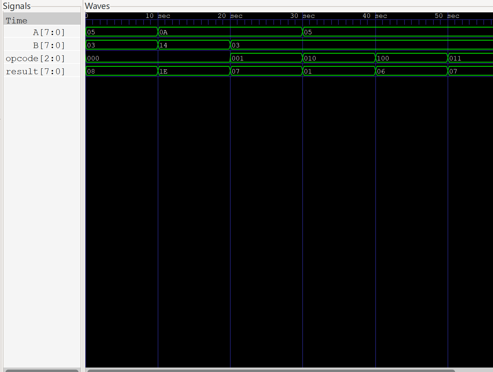
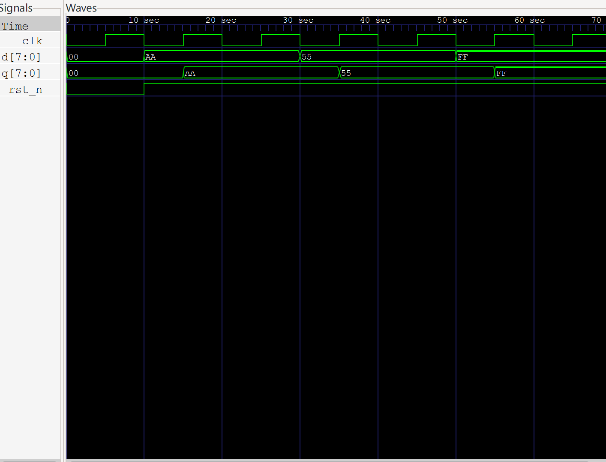
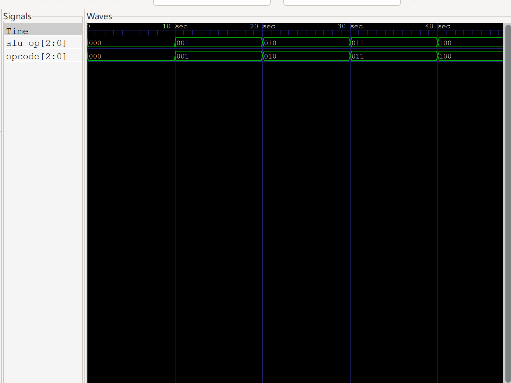
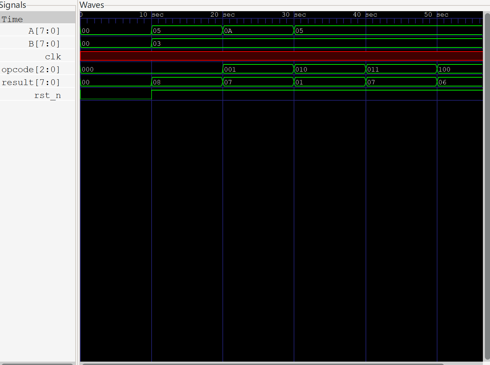

# mini-cpu-verilog
用verilog设计的一个迷你简易cpu
# 8-bit ALU + Control Unit + Register — Verilog 数字电路设计与仿真

本项目是一个基于 Verilog HDL 的 8-bit 数字电路系统，包含算术逻辑单元（ALU）、寄存器、控制单元，以及较为完整的仿真验证环境。


---

## 功能列表
- 8-bit 加法（ADD）
- 8-bit 减法（SUB）
- 按位与（AND）
- 按位或（OR）
- 按位异或（XOR）
- 指令译码（Control Unit）
- 数据锁存（8-bit Register）
- Testbench 自动验证
- GTKWave 波形分析

---

## 系统结构
opcode → Control Unit → ALU → result
                            ↑
                          Register


---

## 仿真结果

### ALU 波形


### 寄存器波形


### 控制单元波形


### CPU 数据通路波形


---

## 工具链
- Verilog HDL
- Icarus Verilog（iverilog）
- GTKWave
- VS Code

---

## 运行方式

### 1. 编译并运行 ALU 测试
```bash
iverilog -o alu_tb.vvp src/alu.v alu_tb.v
vvp alu_tb.vvp


### 2. 编译并运行寄存器测试
bash
iverilog -o register_tb.vvp src/register.v register_tb.v
vvp register_tb.vvp


### 3. 编译并运行控制单元测试
bash
iverilog -o control_unit_tb.vvp src/control_unit.v control_unit_tb.v
vvp control_unit_tb.vvp


### 4. 编译并运行完成CPU通路测试
bash
iverilog -o cpu_tb.vvp src/cpu.v src/control_unit.v src/alu.v cpu_tb.v
vvp cpu_tb.vvp


### 5. 查看波形图
bash
gtkwave x_waveform .vcd

关于项目的一点缺陷和反思：1.没有考虑边界值，比如超过255的运算，这段时间太忙了没时间去思考怎么完善。2.关于github里代码和图片的整理：正常来说，整理的波形图都应该放在docs文件夹里的，这里我不知道怎么的，没放进去，应该是导入的时候没导进去，因为当时用VS code的时候是导进文件夹docs里的，所以导进github的时候也没多想。仿真结果应该都在docs文件夹里的，格式应该是docs/x_waveform.png。但是应该是我导入的问题所以最初只有一张导进docs里了，所以最开始后面三张没有导进docs，最近很忙所以是把第一张图片移除，导致项目里的docs变成空文件夹了，整体不影响项目呈现，但格式存在一点小问题，假期找时间再放进去。3。第一次记录波形图的时候，只记录了波形，忽略了旁边的注释，导致最后看的时候看半天没看懂没对应上，已经改了。4README格式有问题，我不知道为啥最后区分不了步骤全变灰了，改半天没改好，感觉是很简单的问题，但是一直在改我服了，手上还有两个正在想的项目，所以没那么多精力去改这个小细节了，至少目前不影响整体呈现。


